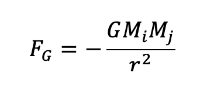

# Assignment

## Using Lambda with N-body problem

Simulate the N-body problem with lambda function in 2 dimensions.

Consider the following constants:

```
/* N bodies */
int N = 5;
/* Gravitational constant */
double G = 6.673e-11;
/* timestep */
double timestep = 0.001;
/* small mass */
double initial_mass = 1.0;
/* num timesteps */
double k = 100;
long comp = 0;
```

Your single body in N-body will look like this:

```
typedef struct body {
    int ind; // index of body
    double mass;
    R position;
    V velocity;
    F *forceVector; // computed {f-i1,fi2...fiN}
    F totalForce; // computed
    A acceleration;  // computed from f = ma
};
```

The magnitude of gravitation force between two objects can be described as



You need to create a single-threaded C++ algorithm to compute force exerted on each body
with respect to other N-1 bodies at each timestep. As the bodies collide you will need to
update the velocity and position and acceleration at each time step.

Make sure you set the initial position, velocity, acceleration, mass, and force vectors
of a body before you begin the iteration timesteps.

Use lambda equations to:

- Update the force exerted on a body
- Update the acceleration on a body
- Update velocity of a body
- Update position of a body
- Compute distance between bodies (x, y) space

You already know how to compute Force for each body using the gravitional equation above
with respect to each of the other N-1 bodies. Where m1 is the mass of this body, and m2 is the
mass of the other bodies from the N-1 bodies. So you will need a for loop to update the
force for each of the N bodies at each timestep.

And from Newton's law, write a lambda for following too:

```
F = m * a
```

Since you know the mass, you can compute the acceleration of each body.

Now that you know the acceleration of each body, the velocity and position of a body at 
ith timestep can be computed as:

New Velocity = Current Velocity + timestep*acceleration
New Position = Current Position + timestep*velocity

So you will need additional loop to compute the velocity and position of each body above
at each time step.

Once you compute the force exerted on each body from each of the other N-1 bodies, you will
need to compute the total force exerted on each body by summing the force from each of the N-1
bodies, and you will need to update the total force this way for each of the N bodies in each
time step. This summation also should use a lambda function.

Assuming you run this test for duration D, and with k timesteps for N bodies, you should write
a final lambda function that computes the number of interactions per second using the following
formula:

```
Interactions/sec = k * N * N / D
```

You should run the above test by varying the number of bodies (N):

```
    int numBodies[] = {10, 20, 50, 100, 200, 500, 1000, 2000};
```

So you can then compute interactions per sec lambda for each value of N in above array.

Optionally print a graph with X axis (N) and Y axis (interactions/sec). If you cannot plot a 
graph using matplotlib or something similar, save the data as a JSON file with two elements per
record. First element should be value of N, and second element should be interactions/sec.
